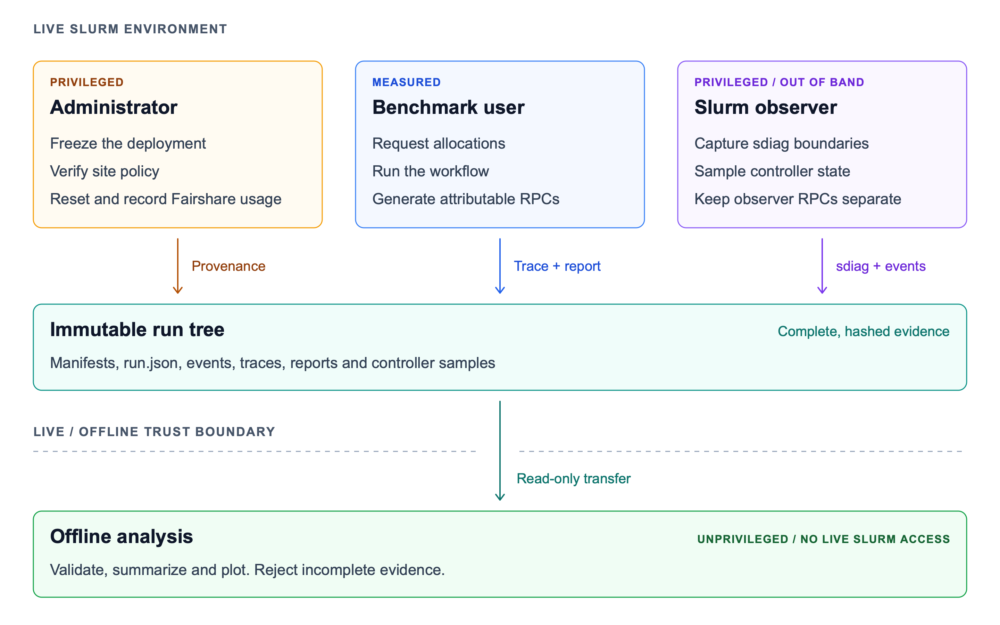

# WfTune
<p align="center">
  
</p>

<div align="center"> Measure · Compare · Tune </div> 

**Portable benchmarking and tuning guidance for scientific workflows on HPC.**

WfTune measures how a workflow deployment affects both user-visible completion
time and the Slurm control plane. It provides a clean-start collection
protocol, workload adapters, controller-side monitoring, campaign auditing,
and analysis for comparing workflow managers and dispatch strategies without
assuming that one strategy is best at every site.

This repository contains tools, configuration templates, and deterministic
synthetic fixtures. It intentionally contains **no real campaign data,
scientific inputs, workflow outputs, credentials, or site configuration**.

## Collection and trust boundary



WfTune separates controlled site actions, measured workflow demand, and
out-of-band observation. Each role writes distinct evidence to an immutable run
tree; validation and analysis then run offline without live Slurm access. This
keeps monitoring traffic out of the benchmark identity's per-user RPC delta and
makes incomplete evidence a hard analysis failure.

## What WfTune measures

The primary measurements share one lifecycle across all supported treatments:

- allocation-inclusive walltime from the controller's pre-submission timestamp
  to a declared scientific endpoint;
- total Slurm RPC count attributed to the benchmark user between root-observed
  `sdiag` boundaries; and
- controller-processing time for that user's RPCs as sensitivity context.

Low-rate cluster-global `sdiag` samples describe the conditions observed during
a run. They are contextual evidence, not automatically attributed background
load. Semantic validation, frozen manifests, configuration hashes, and a
campaign audit keep incomparable or incomplete trials out of the analysis.

## Supported execution paths

| Workflow manager | Native Slurm | Job arrays | HyperQueue | Flux | Local in allocation |
|---|---:|---:|---:|---:|---:|
| Nextflow | Yes | Yes | Yes | Yes | Yes |
| Snakemake | Yes | Yes | — | — | — |

For Nextflow, `native` submits eligible tasks individually, `jobarray` uses
Nextflow's Slurm-array support, `hyperqueue` and `flux` dispatch inside fresh
enclosing allocations, and `local` executes inside one Slurm allocation.

For Snakemake, the current adapters use the official Slurm executor plugin.
The array treatment additionally enables its job-array option. WfTune does not
claim Snakemake support for HyperQueue, Flux, or local execution yet.

## Repository layout

```text
analysis/       campaign audit, summaries, plots, and cross-WMS comparison
config/         reusable Nextflow backend and trace configuration
controller/     root-side preflight, collection, finalization, and manual runner
energy/         standalone RAPL and pluggable PDU sampling/calibration tools
examples/       Slurm entry points and fill-in configuration templates
monitor/        low-rate sdiag and Fairshare capture helpers
```

The `WMSbench_*` environment-variable prefix is retained for compatibility
with the original research harness. Public schemas and new internal symbols
use the `wftune` namespace.

## Requirements

- Collection: Linux, Slurm with per-user `sdiag` statistics, Bash 4.4 or newer,
  Python 3.9 or newer, and root access on the physical controller.
- Nextflow treatments: Nextflow 24.04 or newer; HyperQueue and Flux are needed
  only for their respective treatments.
- Snakemake treatments: Snakemake plus the official Slurm executor and jobstep
  plugins.
- Analysis: the pinned packages in `requirements-analysis.txt`.

## Synthetic smoke test

The fixture generator produces fabricated Slurm records and a synthetic task
trace. Its values are designed only to exercise the audit and plotting path;
they are not scientific observations and must never be reported as results.

Create an analysis environment:

```bash
python3 -m venv .venv
. .venv/bin/activate
python -m pip install -r requirements-analysis.txt
```

Generate and audit one synthetic replicate for two example clusters:

```bash
python examples/synthetic/make_fixture.py /tmp/wftune-example --reps 1

python analysis/audit_campaign.py /tmp/wftune-example \
  --through-rep 1 \
  --venue reference \
  --venue shared \
  --require-secondary-context

python analysis/summarize_results.py \
  /tmp/wftune-example /tmp/wftune-summary \
  --through-rep 1 \
  --venue reference \
  --venue shared

python analysis/plot_walltime_stress.py \
  /tmp/wftune-example /tmp/wftune-walltime-rpc.png \
  --through-rep 1 \
  --venue reference \
  --venue shared
```

See [`examples/synthetic/README.md`](examples/synthetic/README.md) for the
fixture's scope and safeguards.

## Preparing a real campaign

Real collection is intentionally not a one-command laptop benchmark. It
observes a Slurm controller and resets the dedicated benchmark association's
Fairshare usage, so it requires coordination with the site administrator.

1. Install a frozen WfTune checkout at a path visible from the physical
   `slurmctld` host and the main compute allocations.
2. Select a dedicated benchmark user and account. Do not share that account
   with unrelated jobs during collection.
3. Copy and fill the appropriate templates outside the repository:
   - Nextflow: `examples/controller.env.example` and
     `examples/pipeline.env.example`
   - Snakemake: `examples/controller.snakemake.env.example`,
     `examples/snakemake.pipeline.env.example`, and the two profile templates
4. Supply a workflow-specific semantic validator and immutable input,
   pipeline-source, configuration, and container manifests.
5. Install the controller environment and validator as root-owned,
   group/world-nonwritable files.
6. Run preflight on the physical controller before collecting anything.

For example:

```bash
sudo bash controller/check_env.sh /etc/wftune-nextflow.env
sudo bash controller/run_rep.sh \
  /etc/wftune-nextflow.env cluster-a 1 native,jobarray,hyperqueue,flux
```

For Snakemake:

```bash
sudo bash controller/check_env.sh /etc/wftune-snakemake.env
sudo bash controller/run_rep.sh \
  /etc/wftune-snakemake.env cluster-a 1 native,jobarray
```

Repeat with positive block indices for independent replicates. Only one
treatment may run at a time for the same cluster/account/campaign; the shared
lock enforces that rule. Analysis discovers `ROOT/<venue>/repN` trees when no
`--venue` is supplied; pass it explicitly to select a subset.

## Data separation

Keep every real data root outside the source checkout. The controller template
requires separate locations for:

- the root-owned monitoring tree (`WMSbench_MONITOR_ROOT`);
- workflow work, results, traces, and logs (`WMSbench_PIPELINE_ROOT`); and
- the cluster/account campaign lock (`WMSbench_LOCK_ROOT`).

The monitoring tree retains the minimum evidence needed for reproducible
analysis: immutable `run.json`, boundary and periodic `sdiag` snapshots, the
normalized final trace/report, lifecycle handoffs, validation output, and
configuration hashes. Large work directories and scientific results remain in
the separate pipeline tree.

The repository's `.gitignore` excludes common run records and data-root names,
but that is only a last guardrail. Before publishing a dataset, review it for
usernames, cluster names, absolute paths, proprietary workflow inputs, and
site-sensitive scheduler information.

## Analysis

Audit each monitor root before producing a result:

```bash
python analysis/audit_campaign.py /path/to/monitor-root \
  --through-rep 3 --venue cluster-a \
  --backends native,jobarray,hyperqueue,flux \
  --require-secondary-context
```

Then create tables and the walltime/RPC figures:

```bash
python analysis/summarize_results.py \
  /path/to/monitor-root /path/to/output \
  --through-rep 3 --venue cluster-a \
  --backends native,jobarray,hyperqueue,flux

python analysis/plot_walltime_stress.py \
  /path/to/monitor-root /path/to/output/walltime-rpc.png \
  --through-rep 3 --venue cluster-a \
  --backends native,jobarray,hyperqueue,flux
```

Cross-WMS analysis validates each WMS root independently and joins only the
allocation-inclusive walltime and total attributable RPC count:

```bash
python analysis/plot_cross_wms.py \
  --series Nextflow=/path/to/monitor/nextflow \
  --series Snakemake=/path/to/monitor/snakemake \
  --venue cluster-a --through-rep 3 \
  --backends native,jobarray \
  --out /path/to/output/cross-wms.pdf \
  --csv /path/to/output/cross-wms.csv
```

Analysis refuses missing, overlapping, censored, corrupt, or
configuration-drifted runs. It does not generate substitute observations.

## Energy tools

The `energy/` directory contains standalone samplers for node-local RAPL
counters and site-provided PDU power readings, plus a calibration helper. Use
them only on exclusive nodes with an approved reservation; whole-node energy
cannot be attributed to one workflow when unrelated tenants share the node.
See [`energy/README.md`](energy/README.md).

## Operational safety

- Controller collection and Fairshare reset run as root on the physical
  `slurmctld` host. Review the scripts with the site administrator first.
- Never poll Slurm as the benchmark user during the measured window; those
  calls would inflate the same per-user RPC counter being measured.
- Use a dedicated benchmark account and allow its jobs to drain before the
  closing boundary.
- Do not place secrets in controller templates or commit filled `.env` files.
- Treat generated plots as results only after the strict audit passes on real,
  semantically validated observations.

The step-by-step manual Nextflow procedure is documented in
[`controller/manual/README.md`](controller/manual/README.md).

## Research provenance

WfTune grows out of the measurement methodology and case-study artifacts in
the [Slurm-Stress-SC26](https://github.com/NilaBlueshirt/Slurm-Stress-SC26)
repository. The original four-backend study is
[*Balancing Workload Performance and Slurm Stress: Four Nextflow Deployment
Strategies*](https://arxiv.org/abs/2608.13824).

## License

WfTune is released under the [MIT License](LICENSE).
